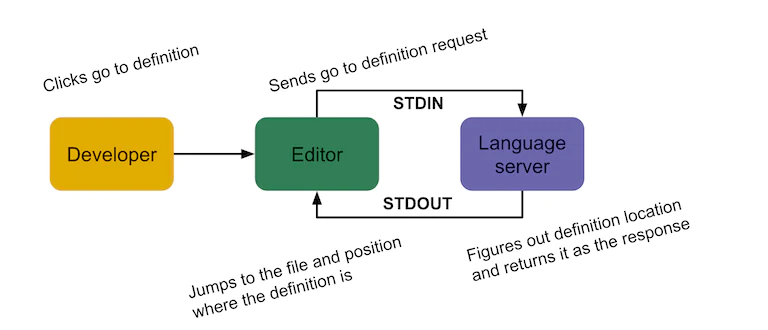

# VSCode
Develop with Visual Studio Code

### Quick links
* [Install](#install)
* [Install Extensions](#install-extensions)
  * [Export Extensions for Nix](#export-extensions-for-nix)
* [Keyboard Shortcuts](#keyboard-shortcuts)
  * [tasks.json](#tasks-json)
* [General Settings](#general-settings)
  * [Powerline glyphs in terminal](#powerline-glyphs-in-terminal)
* [Troubleshooting](#troubleshooting)
  * [Remove All Extensions](#remove-all-extensions)

## Install
```bash
# Install from the cyberlinux repo
$ sudo pacman -S visual-studio-code-bin ripgrep

# Build and install from source
$ yay -Ga visual-studio-code-bin
$ cd visual-studio-code-bin; makepkg -s
$ sudo pacman -U visual-studio-code-bin-1.8.1-3x86_64.pkg.tar.xz
```

## Install Extensions
Note: you can list all your installed extensions with `code --list-extensions`

1. Launch `code`

2. Click the button on the left that looks like an extension icon

3. Install General extensions:

   | Name                     | Identifier                            |
   | ------------------------ | ------------------------------------- |
   | Even Better TOML         | `tamasfe.even-better-toml`            |
   | Code Runner              | `formulahendry.code-runner`           |
   | Color Picker             | `anseki.vscode-color`                 |
   | Copilot                  | `GitHub.copilot`                      |
   | Copilot Chat             | `GitHub.copilot-chat`                 |
   | Dev Containers           | `ms-vscode-remote.remote-containers`  |
   | Dioxus                   | `DioxusLabs.dioxus`                   |
   | Docker                   | `ms-azuretools.vscode-docker`         |
   | Github Markdown Preview  | `bierner.github-markdown-preview`     |
   | Github Pull Request      | `GitHub.vscode-pull-request-github`   |
   | Rainbow CSV              | `mechatroner.rainbow-csv`             |
   | SQL Tools                | `mtxr.sqltools`                       |
   | SQL Tools Driver MySQL   | `mtxr.sqltools-driver-mysql`          |
   | Vim                      | `vscodevim.vim`                       |
   | VSCode Great Icons       | `emmanuelbeziat.vscode-great-icons`   |

4. Install Golang extensions

   | Name                     | Identifier                            |
   | ------------------------ | ------------------------------------- |
   | Go                       | `golang.go`                           |

5. Install Ruby extensions

   | Name                     | Identifier                            |
   | ------------------------ | ------------------------------------- |
   | Ruby                     | `Shopify.ruby-extensions-pack`        |
   | Rubo Cop                 | `rubocop.vscode-rubocop`              |

6. Install Rust extensions

   | Name                     | Identifier                            |
   | ------------------------ | ------------------------------------- |
   | rust-analyzer            | `rust-lang.rust-analyzer`             |
   | CodeLLDB                 | `vadimcn.vscode-lldb`                 |
   | Dependi                  | `fill-labs.dependi`                   |

### Export Extensions for Nix
NixPkgs has a script that can be used to dump vscode extension details into a nix expression that you 
can use in your configuration to install the current versions of all your extensions.

1. Shallow clone `nipkgs` as it's large
   ```bash
   $ git clone -b master --depth 1 https://github.com/NixOS/nixpkgs
   ```
2. Run the script
   ```bash
   $ ./nixpkgs/pkgs/applications/editors/vscode/extensions/update_installed_exts.sh
   ```

## Keyboard Shortcuts
Hit `Ctrl+Shift+p` and search for keyboard then choose `Preferences: Open Keyboard Shortcuts`

| Key sequence   | Description             |
| -------------- | ----------------------- |
| Ctrl+Shift+b   | Run Build Task          |
| Ctrl+Shift+n   | Open new instance       |
| Ctrl+Shift+p   | Open command search     |
| Ctrl+Shift+s   | File: Save All          |
| Ctrl+,         | Open settings           |    
| F12            | Go to Definition        |
| Ctrl+Shift+t   | Run Test Task           |

Keyboard shortcut overrides are found in: `~/.config/Code/User/keybindings.json`
```json
[
    {
        "key": "ctrl+shift+s",
        "command": "workbench.action.files.saveAll"
    },
    {
        "key": "ctrl+shift+t",
        "command": "workbench.action.tasks.test"
    },
    {
        "key": "ctrl+shift+r",
        "command": "workbench.action.tasks.runTask",
        "args": "Run"
    }
]
```

### tasks.json
Every project requires the creation of the `.vscode/tasks.json` file to configure build shortcuts for 
your specific project.

* [VSCode Tasks docs](https://code.visualstudio.com/docs/editor/tasks)

### Golang task example
1. Navigate to VSCode's menu `Terminal >Configure Default Build Task...`
2. Choose `go: build workspace` which will create the `.vscode/tasks.json` for you
3. Replace it's content with the following for a simple Makefiles based build
```json
{
    "version": "2.0.0",
    "tasks": [
        {
            "type": "shell",
            "label": "Build project",
            "command": "make",
            "group": {
                "kind": "build",
                "isDefault": true
            },
        },
        {
            "type": "shell",
            "label": "Test project",
            "command": "make test",
            "group": {
                "kind": "test",
                "isDefault": true
            },
        }
    ]
}
```

## General Settings
Configuration is saved at `~/.config/Code/User/settings.json`

Hit `Ctrl+Shift+p` and search for `json` and select `Preferences: Open Settings(JSON)`
```json
{
    // General configuration
    "explorer.confirmDelete": false,
    "explorer.confirmDragAndDrop": false,
    "telemetry.enableTelemetry": false,
    "telemetry.enableCrashReporter": false,
    "workbench.iconTheme": "vscode-great-icons",
    "terminal.integrated.fontFamily": "InconsolataGo Nerd Font Mono",
    "terminal.integrated.fontSize": 16,

    // Editor configuration
    "editor.tabSize": 4,
    "editor.insertSpaces": true,
    "editor.minimap.enabled": true,
    "editor.fontSize": 14,
    "editor.fontFamily": "Inconsolata-g",
    "editor.formatOnPaste": true,
    "editor.formatOnSave": true,

    "vim.handleKeys": {
        "<C-a>": false,
        "<C-b>": false,
        "<C-c>": false,
        "<C-e>": false,
        "<C-f>": false,
        "<C-h>": false,
        "<C-i>": false,
        "<C-j>": false,
        "<C-k>": false,
        "<C-n>": false,
        "<C-p>": false,
        "<C-s>": false,
        "<C-t>": false,
        "<C-u>": false,
        "<C-v>": false,
        "<C-o>": false,
        "<C-w>": false,
        "<C-x>": false,
        "<C-y>": false,
        "<C-z>": false
    },

    // Golang configuration
    "go.gopath": "~/Projects/go",           // Set the GOPATH to use
    "go.formatTool": "goimports",           // Use specific external format tool for go
    "go.useLanguageServer": true,           // Use the new gopls language server
    "[go]": {
        "editor.snippetSuggestions": "none",
        "editor.formatOnSave": true,
        "editor.codeActionsOnSave": {
            "source.organizeImports": true
        }
    },
    "gopls": {
        "usePlaceholders": false,           // add parameter placeholders when completing a function
        "completionDocumentation": true     // for documentation in completion items
    },
    "go.toolsManagement.autoUpdate": true,  // autoupdate gopls tools
    "files.eol": "\n",                      // gopls formatting only supports LF line endings

    // Rust configuration
    "rust-analyzer.hover.actions.enable": false,
    "rust-analyzer.inlayHints.typeHints.enable": false,
    "rust-analyzer.inlayHints.parameterHints.enable": false,
}
```

### Powerline glyphs in terminal
Powerline depends on fonts that support the particular glyphs that it uses. In order to get them to 
show up properly you need to install the right fonts then set VSCode to use the correct fonts for the 
terminal.

1. Install dependency fonts
   ```bash
   $ sudo pacman -S nerd-fonts-inconsolata-go
   ```
2. Determine the font name to use
   ```bash
   $ fc-list | grep -i inconsolata
   /usr/share/fonts/TTF/ttf-inconsolata-g.ttf: Inconsolata\-g:style=g
   ...
   /usr/share/fonts/TTF/InconsolataGo Nerd Font Complete Mono.ttf: InconsolataGo Nerd Font Mono:style=Regular
   ```
3. Copy out the portion after the first colon
   ```
   Inconsolata-g
   InconsolataGo Nerd Font Mono
   ```
3. Hit `Ctrl+Shift+p` and choose `Preferences: Open Settigns (JSON)` then add
   ```json
   "editor.fontFamily": "Inconsolata-g"
   "editor.fontSize": 14
   "terminal.integrated.fontFamily": "InconsolataGo Nerd Font Mono"
   "terminal.integrated.fontSize": 16
   ```

## Language Servers
The VS Code team at Microsoft proposed the language server protocol to allow for language developers 
to be able to provide support for their language in a generic way that could then be leveraged by any 
Integrated Development Environment or Editor. 

The editor (client) spawns the background process (server) and keeps handles to the STDIN and STDOUT 
pipes, which are used to communicate via JSON. For example when the `Go to Definition` function the 
editor sends a JSON request through STDIN asking the language server to find the definition of 
whatever is currently at the cursor position. The server receives the request, performs the work to 
find the definition location and then returns that as JSON to the editor via STDOUT. The editor 
receives the response and translates it into the action that needs to occur (i.e. jumping to the 
right file at the right position where the definitioni exists.



Standardizing the request and response formats using JSON breaks the coupling between the editor and 
the implementation of programming language freatures. The layer that translates developer actions 
into JSON requests and JSON responses into behavior (the client layer) is only coupled with the 
editor it's implemented for usually via a plugin or extension.

## Troubleshooting

### Remove All Extensions
Extensions are stored in ***~/.vscode/extensions***

To clean up all extensions simply remove this directory

<!-- 
vim: ts=2:sw=2:sts=2
-->
