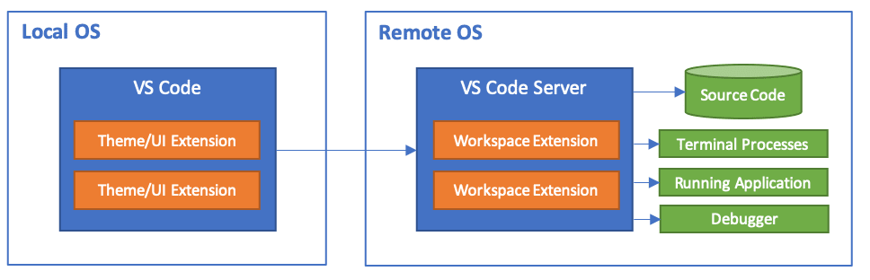

# Dev Containers

### Quick links
* [Overview](#overview)
* [Getting Started](#getting-started)
* [Create a dev container](#create-a-dev-container)
  * [Create a devcontainer.json file](#create-a-devcontainerjson-file)
* [Ruby dev environment](#ruby-dev-environment)

## Overview
Scripting languages like Ruby and Python frequently roll out changes to the language and library 
pieces breaking a system install. To keep the system up to date with the madness is a full time job. 
The only way to develop sanely is to do so from a stable development environment and that is what the 
[Developing inside a container](https://code.visualstudio.com/docs/devcontainers/containers) 
extension and paradigm brings. It is the ability to have a stable well defined environment that won't 
change unless you want it to.

* [Dev containers vscode docs](https://code.visualstudio.com/docs/devcontainers/containers#_getting-started)
* [Dev containers spec](https://containers.dev/implementors/json_reference/)
* [Dev container tutorial](https://code.visualstudio.com/docs/devcontainers/tutorial)

Workspace files are mounted from the local file system. Extensions are installed and run inside the 
container, where they have full access to the tools, platform, and file system. This means that you 
can seamlessly switch your entire development environment just by connecting to a different 
container.



This lets VS Code provide a local-quality debugging experience including full code completions, code 
navigation, and debugging regardless of where your tools and code are located.

### Features
[Dev container features](https://containers.dev/implementors/features/) are self-contained, shareable 
units of installation code and development container configuration. The name comes from the idea that 
referencing one of them allows you to quickly and easily add more tooling, runtimes, or library 
features into your dev container for collaborators to use. Features may require a particular base 
image to start from.

### How it works
1. Your dev image is built from the Dockerfile or image name
2. Then a container is created and started using your `devcontainer.json`
3. vscode environment is then installed and configured according to your `devcontainer.json`
4. Your local copy of vscode connects to the vscode server running inside the dev container

## Getting Started
1. Install VS Code
2. Install Docker
3. Install the `Dev Containers` extension identified as `ms-vscode-remote.remote-containers`
4. Setup the dev container
   1. Create the directory `.devcontainer` in your project
   2. Create the file `.devcontainer/devcontainer.json`

## Create a dev container
**References**
* [VS Code create a dev container docs](https://code.visualstudio.com/docs/devcontainers/create-dev-container)
* [Add additional software to your dev container](https://code.visualstudio.com/docs/devcontainers/create-dev-container#_install-additional-software)

### Create a devcontainer.json file
VS Code's container configuration is stored in a `devcontainer.json` file. This file is similar to 
the `launch.json` file for debugging configurations, but is used for launching (or attaching to) your 
development container instead. The dev container configuration is either located under at 
`.devcontainer/devcontainer.json` or in the root of your project as `.devcontainer.json`.

You can use an image as a starting point for your `devcontainer.json`. An image is like a mini-disk 
drive with various tools and an operating system pre-installed. You can pull images from a container 
registry.

* Install the desired vscode extensions in your dev container to make them accessible during development
* Forward ports from your dev container to make them accessible on your host system

***Example***
```json
{
  "image": "mcr.microsoft.com/devcontainers/typescript-node",

  "customizations": {
    "vscode": {
      "extensions": ["dbaeumer.vscode-eslint"]
    }
  },
  "forwardPorts": [3000]
}
```

### Start your new dev container
1. Click the `Open a Remote Window` button in the lower left of your vscode screen
2. Select the `Open Folder in Container...` option and hit Enter

### Make changes to your dev container
Once VS Code reopens in the container you can use the VS Code terminal and execute any command 
against the OS inside the container. This allows you to install new utilities, spin up databases or 
application services from inside the container.

To persist your changes you'd need to modify the `devcontainer.json` then rebuild. Installing 
additional tooling can be done via the `postCreateCommand` but would be faster if the tools were just 
added to a custom Dockerfile

### Custom Dockerfile for dev container
A custom Docker file `.devcontainer/Dockerfile` can be created to build in custom tooling. Then 
update your `devcontainer.json` to use the following syntax for your custom Dockerfile
```json
{
  "build": { "dockerfile": "Dockerfile" },

  "customizations": {
    "vscode": {
      "extensions": ["dbaeumer.vscode-eslint"]
    }
  },

  "forwardPorts": [3000]
}
```

## Ruby dev environment
The key Ruby pieces for VS Code are the `Ruby LSP` extension from Shopify.

1. Click the `Open a Remote Window` button in the lower left of your vscode screen
2. Select `Add Dev Container Configuration Files...`
3. Enter `ruby` to filter down
4. Select `Ruby` by the `devcontainers` group
5. Select `3.1-bookworm` as the base docker image
5. 
