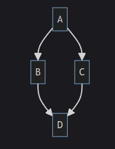
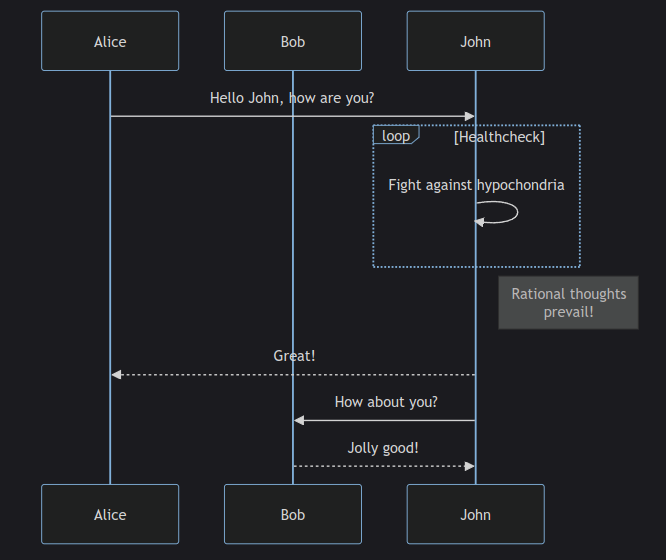
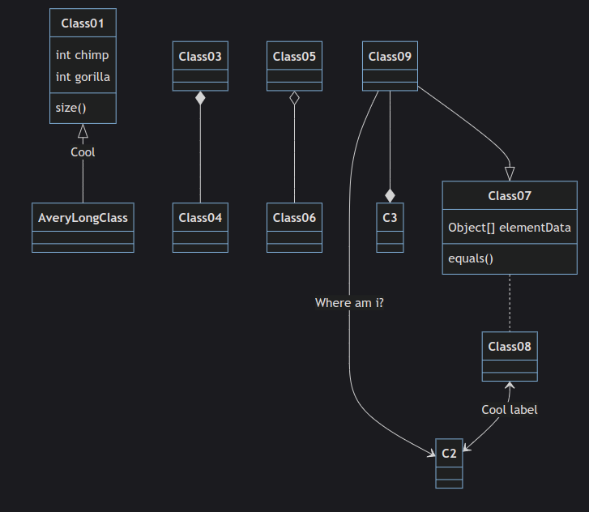
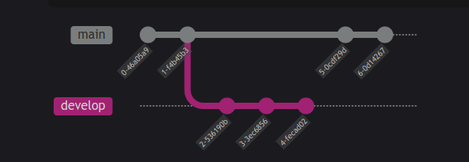
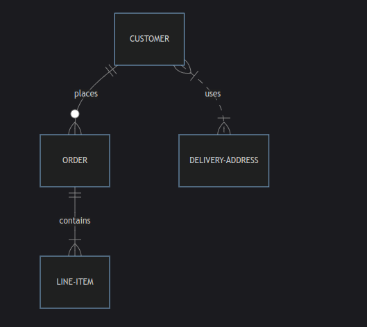
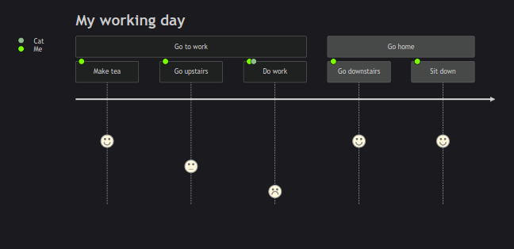
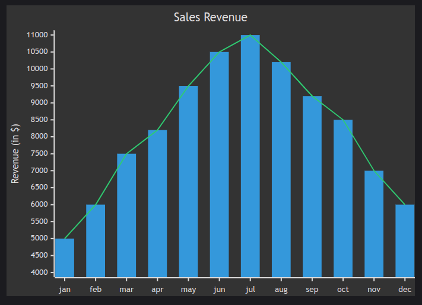

# Mermaid

Mermaid lets you create diagrams and visualizations using text and code. It is a JavaScript based 
diagramming and charting tool that renders Markdown-inspired text definitions to create and modify 
diagrams dynamically. Mermaid's purpose is to help documentation catch up with development.

### Quick links

## Getting Started

**References**
* [Mermaid docs site](https://mermaid.js.org/intro/)
* [Video tutorials](https://mermaid.js.org/config/Tutorials.html)
* [Beginer's Guide](https://mermaid.js.org/intro/getting-started.html)

## Flowchart
```
graph TD;
  A-->B;
  A-->C;
  B-->D;
  C-->D;
```



## Sequence diagram
```
sequenceDiagram
  participant Alice
  participant Bob
  Alice->>John: Hello John, how are you?
  loop Healthcheck
      John->>John: Fight against hypochondria
  end
  Note right of John: Rational thoughts <br/>prevail!
  John-->>Alice: Great!
  John->>Bob: How about you?
  Bob-->>John: Jolly good!
```



## Gantt diagram
```
gantt
dateFormat  YYYY-MM-DD
title Adding GANTT diagram to mermaid
excludes weekdays 2014-01-10

section A section
Completed task            :done,    des1, 2014-01-06,2014-01-08
Active task               :active,  des2, 2014-01-09, 3d
Future task               :         des3, after des2, 5d
Future task2               :         des4, after des3, 5d
```


## Class diagram
```
classDiagram
Class01 <|-- AveryLongClass : Cool
Class03 *-- Class04
Class05 o-- Class06
Class07 .. Class08
Class09 --> C2 : Where am i?
Class09 --* C3
Class09 --|> Class07
Class07 : equals()
Class07 : Object[] elementData
Class01 : size()
Class01 : int chimp
Class01 : int gorilla
Class08 <--> C2: Cool label
```



## Git diagram
```
gitGraph
  commit
  commit
  branch develop
  commit
  commit
  commit
  checkout main
  commit
  commit
```



## Entity relationship diagram
```
erDiagram
  CUSTOMER ||--o{ ORDER : places
  ORDER ||--|{ LINE-ITEM : contains
  CUSTOMER }|..|{ DELIVERY-ADDRESS : uses
```



## User journey diagram
```
journey
  title My working day
  section Go to work
    Make tea: 5: Me
    Go upstairs: 3: Me
    Do work: 1: Me, Cat
  section Go home
    Go downstairs: 5: Me
    Sit down: 5: Me
```



## Quadrant diagram
```
quadrantChart
  title Reach and engagement of campaigns
  x-axis Low Reach --> High Reach
  y-axis Low Engagement --> High Engagement
  quadrant-1 We should expand
  quadrant-2 Need to promote
  quadrant-3 Re-evaluate
  quadrant-4 May be improved
  Campaign A: [0.3, 0.6]
  Campaign B: [0.45, 0.23]
  Campaign C: [0.57, 0.69]
  Campaign D: [0.78, 0.34]
  Campaign E: [0.40, 0.34]
  Campaign F: [0.35, 0.78]
```


## XY diagram
```
xychart-beta
  title "Sales Revenue"
  x-axis [jan, feb, mar, apr, may, jun, jul, aug, sep, oct, nov, dec]
  y-axis "Revenue (in $)" 4000 --> 11000
  bar [5000, 6000, 7500, 8200, 9500, 10500, 11000, 10200, 9200, 8500, 7000, 6000]
  line [5000, 6000, 7500, 8200, 9500, 10500, 11000, 10200, 9200, 8500, 7000, 6000]
```



<!-- 
vim: ts=2:sw=2:sts=2
-->
