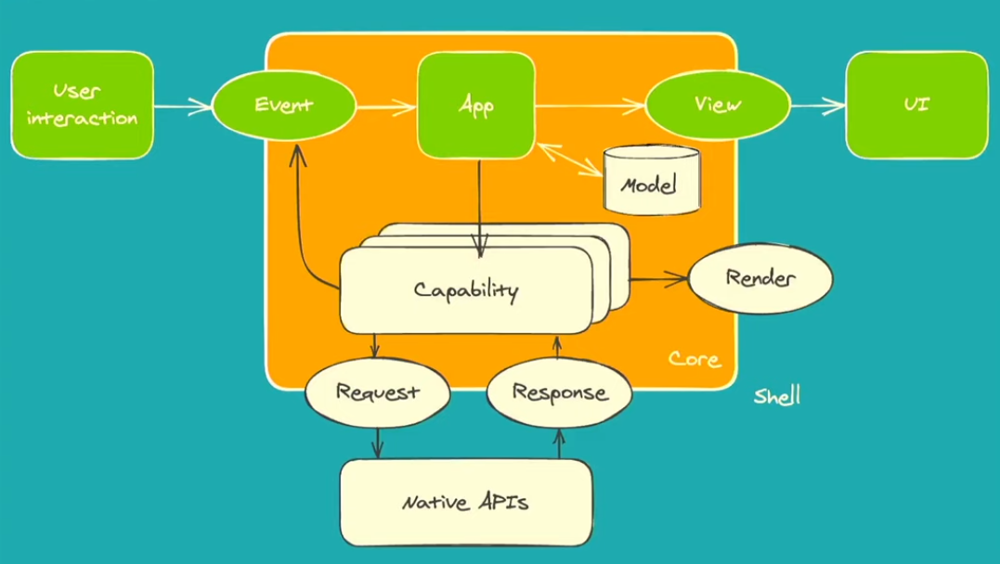

# Mobile 

Rust in the mobile space means writing an application once and deploy it on iOS, Android and the Web. 
At least that is the dream.

### Quick links
- [.. up dir](../README.md)
* [Overview](#overview)

## Overview
Typically the industry has used Rust for lower level libraries that are not platform dependent. They 
start writing them in high level languages like Swift or Kotlin and then want to reuse and share 
their code for the different platforms but realize that the expertise to be safe and productive in a 
lower level sharable lanugage is much more approachable with Rust than C/C++.

The target is usually Headless apps or supporting libraries but hopefully that will be changing soon.

### Headless Apps
Notes on a talk from [Rust Nation in Feb 2023. from Stuart Harris](https://www.youtube.com/watch?v=cWCZms92-1g),
founder of Red Badger.

* Headless app definition
  * Share behavior across platforms by encasulating it as a pure core and push side affects to shell
    * Functional core (pure logic) imperative shell (side affects i.e. going out to apis, uis)
    * This allows for fantastic testability of the core, shift left on app quality and allows us to 
      deal with the problems upfront rather than waiting for a user to click something and fail
    * Ports & Adapters pattern (a.k.a Hexagonal, Clean, Onion Architecture)
  * Strict contract between core and shell
  * Acknowledge the platform i.e. shell is best at UI 
    * UI is a side affect, users clicking on buttons; push to the edge
    * Declarative UI is brilliant i.e. Swift UI and Jetpack Compose
* Current landscape
  * React Native
    * Good UX
    * Shared logic
    * Maintenance 
  * Flutter (best option)
    * Full stack but not native
    * Everything shared
    * Plugins
    * Dart language
  * Kotlin Multi-platform Mobile
    * Platform native UX
    * Shared logic
    * Access to native APIs
    * Kotlin and Swift language
  * Capacitor/Ionic
    * Hybrid (any web stack)
    * Access to native apis
    * Plugins
    * Typscript
    * https://tauri.app/blog/2022/12/09/tauri-mobile-alpha

## CRUX
[CRUX](https://redbadger.github.io/crux) a new open source library for building headless apps

* Rust on all three platforms
* Platform Native UX
* Shared behavior
* Capabilities
* Rust and Swift, Kotlin, TypeScript
* https://redbadger.github.io/crux
* Ports and Adapters Pattern
  * Allow an application to equally be driven by users, programs, automated test or batch scripts, 
  and to be developed and tested in isolation from its eventual run-time devices and databases.
  * Alistair Cockburn `Hexagonal architecture` 2005
  * User triggers event through shell adapter into a core port
  * core sends out through a port to an adapter and the shell drives effects
  * The app can be deployed in a headless mode so that only the API is available and other programs 
  can make use of its functionality
* Supports
  * iOS, Android, Web, Yew, CLI
  * uniffi-bindgen, wasm-bindgen
  * type generation with `serde-generate`

## Bazel
Bazel makes building Rust for mobile platforms easier.
