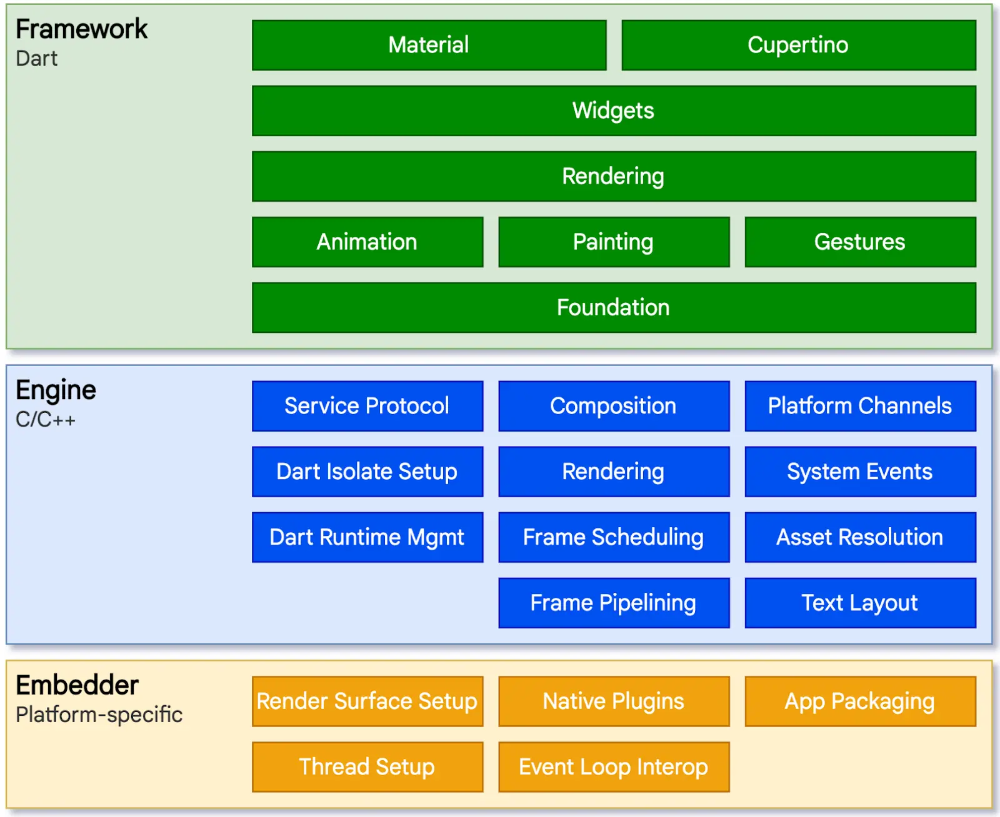

# Flutter

Flutter is Google’s free, open-source software development kit (SDK) for cross-platform mobile 
application development. Using a single platform-agnostic codebase, Flutter helps developers build 
high-performance, scalable applications with attractive and functional user interfaces for Android or 
IOS. Flutter relies on a library of pre-made widgets that make it simple for even people with limited 
programming or development experience to launch their own mobile applications quickly.

Created by Google in 2015 and officially launched in 2018, Flutter has quickly become the toolkit of 
choice for developers. According to Statista, Flutter has recently surpassed React Native to become 
the number one mobile app development framework.

source [content URL](https://stackoverflow.blog/2022/02/21/why-flutter-is-the-most-popular-cross-platform-mobile-sdk/)

## Overview
Flutter is a layered system comprising the framework, the engine, and platform-specific embedders. 
Flutter applications are built using Google’s Dart object-oriented programming language. The Flutter 
engine itself is written primarily in C/C++. And the Skia library is the backbone of Flutter’s 
graphics capabilities.

Flutter’s suitability for cross-platform development goes beyond code portability. Unlike other 
cross-platform frameworks such as React Native and Xamarin, Flutter-built user interfaces (UI) are 
also platform-agnostic because Flutter’s Skia rendering engine does not require any platform-specific 
UI components.



**References**
* [Flutter Awesome](https://flutterawesome.com/)
* [Flutter multi-platform](https://flutter.dev/multi-platform)
* [Flutter Folio Example App site](https://flutter.gskinner.com/folio/)
* [Flutter Folio Example App Github](https://github.com/gskinnerTeam/flutter-folio)

**Benefits**
* Cross-platform Android, iOS, WASM, Windows, MacOS, Linux
* Dart language compiles to JavaScript or machine code
* Native-compiled performance with no embedded browser engine
* Hardware-accelerated graphics for all platforms
* Widget library adapts for any screen size
* Rendering engine allows for control of every pixel
* Instant hot reloading
* Supported by Google
* Flutter Casual Games Toolkit

## Arch Linux Pre-requisites

**References**
* [Arch Linux getting started with flutter](https://dev.to/nabbisen/flutter-3-on-arch-linux-getting-started-fc0)

1. Install pre-requisites
   ```bash
   $ sudo pacman -S dart clang cmake ninja base-devel
   ```

2. Install Flutter 3.0
   ```bash
   $ yay -GA flutter
   $ cd flutter
   $ makepkgs -s
   $ sudo pacman -U flutter-3.16.0-1-x86_64.pkg.tar.zst
   ```

## Desktop setup

## Android setup
1. Install [android tooling](../../../android/emulator)

## Rust Integration

**References**
* [Cargo flutter](https://github.com/flutter-rs/cargo-flutter)
* [Flutter app demo desktop](https://github.com/flutter-rs/flutter-app-demo)

<!-- 
vim: ts=2:sw=2:sts=2
-->
