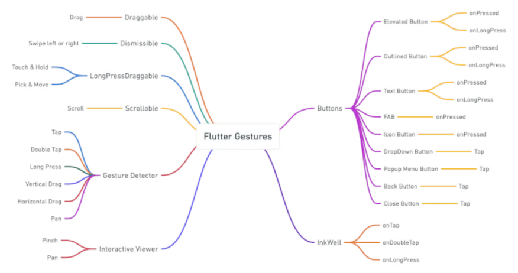

# Flutter

Flutter is Google’s free, open-source software development kit (SDK) for cross-platform mobile 
application development. Using a single platform-agnostic codebase, Flutter helps developers build 
high-performance, scalable applications with attractive and functional user interfaces for Android or 
IOS. Flutter relies on a library of pre-made widgets that make it simple for even people with limited 
programming or development experience to launch their own mobile applications quickly.

Created by Google in 2015 and officially launched in 2018, Flutter has quickly become the toolkit of 
choice for developers. According to Statista, Flutter has recently surpassed React Native to become 
the number one mobile app development framework.

source [content URL](https://stackoverflow.blog/2022/02/21/why-flutter-is-the-most-popular-cross-platform-mobile-sdk/)

### Quick links
* [Overview](#overview)
* [Setup Flutter on Arch Linux](#setup-flutter-on-arch-linux)
* [Flutter with Android Studio](#flutter-with-android-studio)
  * [Configure Flutter project in Android Studio](#configure-flutter-project-in-android-studio)
* [Flutter commandline](#flutter-commandline)
  * [Create project](#create-project)
  * [Build for Desktop](#build-for-desktop)
* [Flutter Patterns](#flutter-patterns)
  * [Display Image](#display-image)
  * [Launch Screen](#launch-screen)
  * [Responsive](#responsive)
  * [Build methods](#build-methods)
  * [Custom Widgets](#custom-widgets)
  * [Launch Screen](#launch-screen)
* [Flutter platform](#flutter-platform)
  * [pubspec](#pubspec)
  * [Basic widgets](#basic-widgets)
  * [Display an Image](#display-an-image)
  * [Future Builder](#future-builder)
  * [Gestures](#gestures)
  * [Layout](#layout)
  * [Navigation](#navigation)
  * [Keyboard Input](#keyboard-input)
  * [State](#state)
  * [Slivers](#slivers)
  * [Themes](#themes)
* [Dart](#dart)
  * [Parameters](#parameters)
  * [static vs final vs const](#static-vs-final-vs-const)

## Overview
Flutter is a layered system comprising the framework, the engine, and platform-specific embedders. 
Flutter applications are built using Google’s Dart object-oriented programming language. The Flutter 
engine itself is written primarily in C/C++. And the Skia library is the backbone of Flutter’s 
graphics capabilities on desktop platforms while Impeller handles graphics for iOS and Android.

Flutter’s suitability for cross-platform development goes beyond code portability. Unlike other 
cross-platform frameworks such as React Native and Xamarin, Flutter-built user interfaces (UI) are 
also platform-agnostic because Flutter’s Skia rendering engine does not require any platform-specific 
UI components. All desired UI components have been rebuilt in Flutter and are readily available thus 
reducing development time.


**References**
* [Flutter samples](https://github.com/flutter/samples/tree/main)
* [Flutter Awesome](https://flutterawesome.com/)
* [Flutter multi-platform](https://flutter.dev/multi-platform)
* [Flutter Folio Example App site](https://flutter.gskinner.com/folio/)
* [Flutter Folio Example App Github](https://github.com/gskinnerTeam/flutter-folio)
* [Flutter plugins for desktop](https://github.com/google/flutter-desktop-embedding)
* [Flutter 3.16 update](https://dev.to/svprdga/flutter-316-released-android-impeller-preview-game-toolkit-updates-ios-extensions-and-more-1c7n)
* [Flame - Flutter Based Game Engine](https://pub.dev/packages/flame)
* [Awesome Flame](https://github.com/flame-engine/awesome-flame)
* [Flutter docs](https://flutter.dev/docs)
* [Flutter cookbook](https://docs.flutter.dev/cookbook)
* [Dart pad with Flutter](https://dartpad.dev/?id=e7076b40fb17a0fa899f9f7a154a02e8)
* [Pub dev - Dart and Flutter package repo](https://pub.dev/)

**Benefits**
* Cross-platform Android, iOS, WASM, Windows, MacOS, Linux
* Dart language compiles to JavaScript or machine code
* Native-compiled performance with no embedded browser engine
* Hardware-accelerated graphics for all platforms
* Widget library adapts for any screen size
  * Material 3 and Cupertino visual styles
* Rendering engine allows for control of every pixel
* During development Flutter apps run in a VM that offers stateful hot reload of changes
  * For release, Flutter apps are compiled directly to machine code
* Supported by Google
* Flutter Casual Games Toolkit
* Impeller in 3.16 for improved rendering engine
  * Only good for Vulkan i.e newer devices
  * OpenGL not yet supported i.e. older devices

**Negatives**
* Flutter apps include all necessary code for widgets and don't rely on platform making binaries bigger
* Still relatively new platform
* Have to learn Dart

## Setup Flutter on Arch Linux
Reference: [getting started with Flutter on Arch Linux](https://dev.to/nabbisen/flutter-3-on-arch-linux-getting-started-fc0)

1. Install [android tooling](../../../android/emulator)

2. Install [android studio](../../../android/index.html#android-studio)
   1. Install the `Flutter` plugin from the `File >Settings... > Plugins` menu
   2. Install the `Dart` plugin from the `File >Settings... > Plugins` menu

3. Install pre-requisites
   ```bash
   $ sudo pacman -S dart clang cmake ninja base-devel
   ```

4. Install Flutter latest
   ```bash
   $ yay -GA flutter
   $ cd flutter
   $ makepkgs -s
   $ sudo pacman -U flutter-3.16.0-1-x86_64.pkg.tar.zst
   ```

5. Run flutter doctor after setting exceptions
   ```bash
   $ git config --global --add safe.directory /opt/flutter
   $ flutter config --android-sdk $ANDROID_HOME
   $ flutter doctor --android-licenses
   ```

## Flutter with Android Studio
Warning: I'm not recommending this path as I find Android Studio to be slow and clunky. The VS Code 
path is a much better experience.

### Configure Flutter project in Android Studio
1. Click the `New Flutter Project`
2. Select the `Flutter` entry on the left then set the `Fluter_SDK path` to `/opt/flutter`
3. Click the `Next` on the flutter view
4. Name the project e.g. `cross_platform_example` then click `Create`
5. Wait a min for the project template to be downloaded and populated

6. Create a new emulator in the IDE and click the `Run` button for an android build

## Flutter with VS Code
1. [Install and configure VS Code](../../../editors/vscode)
2. Install the `Flutter` extension

### Run with VS Code
This will build and deploy your app to the device you have selected and keep it in a hot-reload mode 
such that any changes to your app will be updated in the target device when you save your changes.

Note it is possible to run the emulator directly from VS Code but for some reason this put it in a 
bad state where VS Code wasn't able to connect and I had to delete it and create a new one and start 
over and run it via the terminal instead.

1. Start the emulator in the terminal
   ```bash
   $ emulator -avd android30
   ```

2. Run the code in the target device with the debuggerr for hot-reloading
   1. In the top right hand corner of your `main.dart` file hit the button for `Start Debugging` or press `F5`. 
   2. Every time you save your changes it will be hot-reloaded on the target device

### VS Code Refactor
The refactor capabilities of the Flutter plugin are top-notch. Selecting widgets and activating 
refactor allows you to quickly wrap widgets in other widgets to allow for rapid layout configuration 
changes or extract code into their own widgets for rapid development.

## Flutter commandline

### Create project
```bash
$ flutter create <project-name>

# Overrides
# flutter create --platforms=linux,android <project-name>
```

### Run with Flutter commandline
Running an application directly with Flutter in this way will provide an interactive terminal for 
updating and managing your application including hot-reloads, hot-restarts and links to pull up debug 
tools in the browser for interacting with the Dart VM that is used during debug builds.

1. Launch app on Desktop with the Dart VM via Flutter
   ```bash
   $ flutter run -d linux
   ```

2. Launch app on Emulator with the Dart VM via Flutter
   1. Start the emulator
      ```bash
      $ emulator -avd android30
      ```
   2. List out the available devices
      ```bash
      $ adb devices
      List of devices attached
      emulator-5554	device
      ```
   3. Run on the emulator
      ```bash
      $ flutter run -d emulator-5554
      ```

2. Press `r` to hot-reload your app after changes

### Build for Desktop
Flutter uses GTK for Linux

1. Build for linux Desktop
   ```bash
   $ flutter build linux --release
   ```
2. Binary will end up in `build/linux/x64/release/bundle`
   * `data` contains the application's data assets, such as fonts or images 
   * `lib` contains the required .so library files

### Build and install for Android
1. Build release
   ```bash
   $ flutter build apk --release
   ``` 

2. Install to connected device
   ```bash
   $ flutter install --release
   ``` 

### Project creation
* ***Create a new project with specific platform support***
  * `flutter create --platforms=linux,android <project-name>`

* ***Add specific platform support to an existing project***
  * `flutter create --platforms=linux .`

## Flutter Patterns
* ***Custom Widgets*** are a best practice for reusability
* ***Pass Widgets*** widgets as parameters to other widgets is a standard practice
* Keep state as close to the area of concern as possible
  * Keep it in the widget if that is all that needs it
  * Keep it at the lowest level in the widget tree that ensures it lives long enough to be useful

### Build methods
In Flutter when a parent widget receives a callback and updates its internal state it will then 
trigger a rebuild which will then rebuild all the widgets below it if they have changed. The 
framework does this by comparing the newly built widgets with the previously built widgets and only 
applying the differences to the underlying RenderObject.

### Custom Widgets
Reduce your widgets to only accept what they use as parameters not all app state.

### Launch Screen
Launch screens, a.k.a splash screens, provide a simple initial experience while your app loads. They 
set the stage for your application, while allowing time for the app engine to load and your app to 
initialize.

**References**
* [Flutter docs - Splash screen](https://docs.flutter.dev/platform-integration/android/splash-screen)

### Responsive
Flutter apps might appear on screens of many different sizes. Ideally you want your app to be both 
***adaptive*** and ***responsive***. Flutter's primary means of handling responsiveness is to use the 
`LayoutBuilder` which will redraw the UI whever the size constraints change providing the ability for 
things like:

```dart
child: Layoutbuilder(
  builder: (context, constraints) {
    if (constraints.maxWidth > 1200) {
      return UltraWideLayout();
    } else if (constraints.maxWidth > 600) {
      return WideLayout();
    } else {
      return NarrowLayout();
    }
```

```dart
if (Theme.of(ctx).platform == TargetPlatform.iOS) {
  // Alternatively you can use dart:io.Platform
}
```

The constraint sizes are device neutral meaning they are supposed to be the same thing on every 
screen and it doesn't matter resolution, density etc...

***Responsive***  
Typically, a responsive app has had its layout tuned for the available screen size. Often this means 
re-laying out the UI if the user resizes the window, or changes the device's orientation.

***Adaptive***  
Adaptive apps can adapt to the device's platform capabilities such as different kinds of input 
devices e.g. keyboard and mouse vs touch.

**References**
* [Flutter docs - responsive app](https://docs.flutter.dev/ui/layout/responsive/adaptive-responsive)
* [Building adaptive apps](https://docs.flutter.dev/ui/layout/responsive/building-adaptive-apps)


## Flutter platform
Every app has a `main()` which runs your root widget. Every widget has a `build` which must return a 
widget or tree of widgets so that Flutter nows what to draw. Widgets can be nested as desired.

**References**
* [Flutter UI docs](https://docs.flutter.dev/ui)
* [Material 3 demo](https://flutter.github.io/samples/web/material_3_demo/)
* [Material 3 docs](https://docs.flutter.dev/ui/widgets/material)
* [Material 3 Icons](https://fonts.google.com/icons)

### pubspec
The `pubspec.yaml` in the root of your Flutter project is the main project file tracking dependencies 
and configuration for your project

### Basic widgets
* ***Text*** styled text

### Display an Image
The ***Image*** class renders an image to the screen. Flutter supports: JPEG, PNG, Animated GIF, 
Animated WebP, BMP, and WBMP. In order to render the images to the screen Flutter needs to cache them 
as raw images so a lot of memory may be required. You can work around this by setting the custom 
decode size to limit how much memory is consumed by the cache.

* [Flutter Image class docs](https://api.flutter.dev/flutter/widgets/Image-class.html) 
* [Easy image viewer on pub.dev](https://pub.dev/packages/easy_image_viewer)
* [File picker example](https://www.geeksforgeeks.org/flutter-pick-and-open-files-from-storage/)

**Images from assets**
```dart
Image.asset(
  'assets/images/dash.jpg'
)
```
Image assets will automatically show the correct image for the devices pixel density

**Images from file**
```dart
Image.file(
  '/path/to/dash.jpg'
)
```

**Images from network**
```dart
Image.network(
  'http://example.com/dash.jpg'
)
```
Flutter will automatically download and cache the image. You can use the `loadingBuilder` function to 
show loading progress while being downloaded

**Images from memory as byte arrays**
```dart
Image.memory(
  myUint8List,
)
```

### Future Builder
The `FutureBuilder` widget will take a future and handle the different states of the future i.e. 
completed, failed and waiting.

### Gestures
By using the built in widgets to handle gestures rather than directly with the gesture detecter you 
get built in animations as well.



**References**
* [Choose the right gesture widgets](https://blog.logrocket.com/choosing-the-right-gestures-for-your-flutter-project/)
* [Vertical Drag](https://blog.logrocket.com/handling-gestures-flutter-gesturedetector/)

* ***Dismissible*** allows for flicking an item left or right to dismiss, think delete or archive

### Layout

* ***BoxDecoration*** lets you decorate the `Container` widget
* ***Column*** takes any number of children and puts them in a column from top to bottom
* ***Container*** lets you create a rectangular visual element that can be decorated
* ***Expanded*** wrapper to be used inside other widgets to greedily expand to fill available space
* ***LayoutBuilder*** common parent to trigger rebuilds if screen size orientation or size changes
* ***Row*** takes any number of children and puts them in a row from left to right
* ***Scaffold*** per screen/page it provides basic material styling and layout components
* ***SafeArea*** defines space that should be visible beyond the camera and options menus etc...
* ***Stack*** lets you place widgets on top of each other in paint order
* ***Placeholder()*** fantastic idea for building out layouts without any content yet
* ***Positioned*** can be used on children of a `Stack` to position them relative to it

### Navigation
Flutter's Material 3 implementation provides several navigation options:
* ***AppBar*** - advanced navigation and actions bar at top
* ***BottomAppBar*** -  advanced navigation and actions bar at bottom
* ***BottomNavigationBar*** - advanced navigation and actions bar at bottom
* ***NavigationBar*** - simple switching between primary destinations
* ***NavigationDrawer*** - lkj
* ***NavigationRail*** - bar on the side of the screen that can optionally expand to include labels
* ***TabBar*** - lkj

**References**
* [Material 3 Navigation](https://docs.flutter.dev/ui/widgets/material#Navigation)
* [Navigation basics - Flutter docs](https://docs.flutter.dev/cookbook/navigation/navigation-basics)

The `NavigationRail` provides a left side navigation menu that can be:
* `extended` to show icon and label in a larger screen setting
* `selectedIndex` provides option to choose which button is the default selection
* `onDestinationSelected` callback when buttons are pressed

**Routes** are a natural part of the navigation conversation. Each route is just a widget that we 
load as a new screen using the `Navigator.push` method.

**Push a new route**
```dart
onPressed: () {
  Navigator.push(
    context,
    MaterialPageRoute(builder: (context) => const SecondRoute()),
  );
}
```

**Return to the prior route**
```dart
onPressed: () {
  Navigator.pop(context);
}
```

### Keyboard input


### State
Flutter uses `StatefulWidgets` to generate `State` objects, which are then used to hold state. 
Widgets and State objects have different life cycles. Widgets are used for presentation and are 
frequently destroyed and recreated with changes while State is persisted between calls to the 
`build()` method.

**References**
* [State Management - Flutter docs](https://docs.flutter.dev/data-and-backend/state-mgmt/intro)

* ***ChangeNotifier*** creates state and dependencies can watch for notifications and rebuild

### Slivers
A sliver is a portion of a scrollable area inside a CustomScrollView that can be configured 
accordingly to behave in a certain way. Using slivers we can create a plethora of different scrolling 
effects. Slivers lazy build their views when the widgets come into the viewport. This makes it ideal 
for showing a great number of children without worrying about memory issues.

**References**
* [Slivers - Log Rocket](https://blog.logrocket.com/building-custom-flutter-scrollview/)

***CustomScrollView***  
A widget that uses multiple Slivers rather than just one. 

**Slivers that can go inside CustomScrollView**
* `SliverAppBar` - creates a collapsible app bar by setting both the `flexibleSpace` and `expandedHeight`
* `SliverToBoxAdapter` - sliver that allows you to wrap non-sliver widgets inside a CustomScroolView
* `SliverGrid` - sliver that displays a 2D array
* `SliverFixedExtentList` - like SliverList but guarantees all items will remain the same size
* `SliverList` - sliver that renders a list in a linear array along the scroll view's main axis.
  * `SliverChildListDelegate` - specifies a fixed list of children that are created all at once
  * `SliverChildBuilderDelegate` - specifies how to build them lazily
* `SliverOpacity` - sliver makes its sliver child partially transparent
* `SliverPadding` - sliver that creates empty space around another sliver

### Themes
You can choose any color with `Color.fromRGB0(0, 255, 0, 1.0)` or `Color(0xFF00FF00)`. Flutter uses 
an app wide Theme that all widgets respect to provide a matching suite of colors.

**Set Theme Color Scheme** with the `seedColor`
```dart
theme: ThemeData(
  useMaterial3: true,
  colorScheme: ColorScheme.fromSeed(seedColor: Colors.blue),
),
```

**Set text to medium**
```dart
final style = theme.textTheme.displayMedium!.copyWith(
  color: theme.colorScheme.onPrimary,
);
```

**Get current theme**
```dart
final theme = Theme.of(context);
```

## Dart

### Parameters
* [Dart functions docs](https://dart.dev/language/functions)

The parameters of a class constructor or fucntion are required by default.
```dart
class Test {
  final String x;
  Test(this.x);
}
```

### static vs final vs const
* ***static*** means a member is available on the class itself instead of on instances of the class
* ***final*** means single-assignment i.e. it must be initialized and cannot be changed
* ***const*** means that the object can be determined completely at compile time and frozen

## Rust Integration

**References**
* [Cargo flutter](https://github.com/flutter-rs/cargo-flutter)
* [Flutter app demo desktop](https://github.com/flutter-rs/flutter-app-demo)

<!-- 
vim: ts=2:sw=2:sts=2
-->
