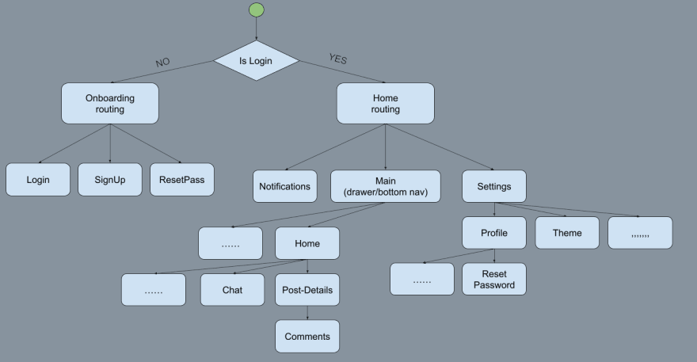

# Routing
Flutter provides a complete system for navigating between screens and handling deep links. Small 
applications without complex deep linking can use `Navigator` directly while apps with specific deep 
linking and navigation requirements should use the underlying `Router` to correctly handle deep 
links and keep the address bar in sync with the current screen.

### Quick links
* [Flutter Navigation and Routing](https://docs.flutter.dev/ui/navigation)

## Navigator
The Navigator widget displays screens as a stack using the correct transition animations for the 
target platform. To navigate to a new screen, access the Navigator through the route's BuildContext 
and call imperative methods such as `.push()` or `.pop()`

```dart
onPressed(): () {
  Navigator.of(context).push(
    MaterialPageRoute(builder: (context) => SongScreen()),
  );
}
```

The `MaterialPageRoute` is a subclass of `Route` and provides transitions for the Material Design.

## Router
Flutter's built in router (i.e. named routes) has limitations that make is unacceptable for the Web 
case and not recommended by the Flutter team for:
* Named routes have can't be customized and don't support forward button in browsers
* No support for route parsing for path or query parameters or wildcard matching
* Imperative Navigator calls for large apps will be difficult to maintain and debug
* Built in Navigator and Router lack customizability for routing transitions and animations
* No global state management for sharing data between routes
* Difficult to ensure consisten patterns are being used in larger codebases

### Go Router
Instead the Flutter team recommends the [`go_router`](https://pub.dev/packages/go_router) package 
which they maintain and provides better support for direct links to screens and deep linking support 
for Web. Go router also supports route path parsing and other Web type functionality.

The primary benefit of Go router is:
* declarative named routes support
* path and query parameter support
* wildcard matching on routes
* custom routing transitions
* deep linking for all pages
* easy loading and error states

```dart
MaterialApp.router(
  routerConfig: GoRouter(
    // ...
  ),
);
```

### Route design example flowchart


```dart

static GoRouter onBoardingRouter(AuthState authState) => GoRouter(
  initialLocation: "/logIn",
  navigatorKey: onBoardingNavigatorKey,
  routes: [
    GoRoute(
      name: "login",
      path: "/logIn",
      builder: (context, state) => const LoginPage(),
      //Example of redirection        
      redirect: (context, state) => authState == AuthState.loading ? "/splash" : null,
    ),
    GoRoute(
      name: "splash",
      path: "/splash",
      builder: (context, state) => const SplashPage(),
    ),
    GoRoute(
      name: "signUp",
      path: "/signUp",
      builder: (context, state) => const SignUpPage(),
    ),
    GoRoute(
      name: "passwordReset",
      path: "/passwordReset",
      builder: (context, state) => const ResetPasswordPage(),
    ),
  ],
);
```

### GoRoute
This is the main route type. You declare your route with its name and path and potential redirect 
along with populating the `builder` function with the content to render e.g. MyContentPage1. Each 
GoRoute can also have sub routes and you specify them in the `routes` list.

### Common error page
You can populate the `errorBuilder` to give a consistent navigation error accross your application.

```dart
errorBuilder: (context, state) {
  return ErrorPage(ErrorCode.e404);
},
```

### ShellRoute
Go router has different kinds of routes. The `ShellRoute` is a basic container that provides a 
`builder` where any content widgets would get rendered.

<!-- 
vim: ts=2:sw=2:sts=2
--
