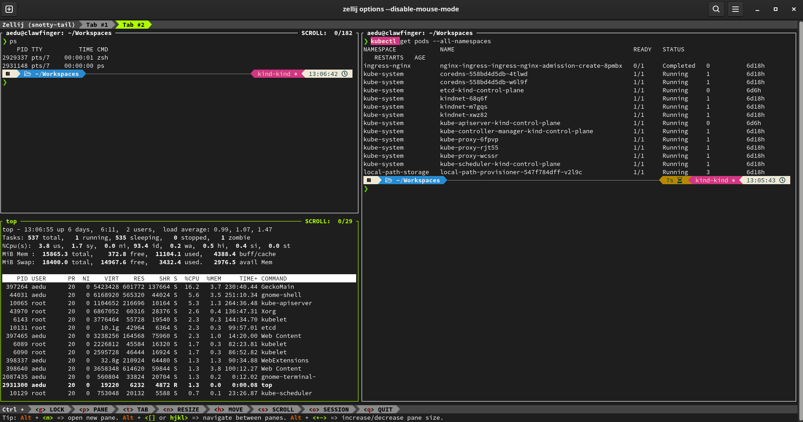

# Zellij 

A terminal window manager built in Rust that uses WASM for its plugin system.

### Quick links
- [.. up dir](..)
- [Overview](#overview)
  - [Features](#features)
- [Zellij vs TMUX](#zellij-vs-tmux)
- [Usage](#usage)
  - [Attach](#attach)
  - [Key Bindings](#key-bindings)
    - [Pane Management](#pane-management)
    - [Tab Management](#tab-management)
    - [Session Management](#session-management)
  - [Copy/Paste with Neovim](#copypaste-with-neovim)
    - [Selecting with the mouse](#selecting-with-the-mouse)
    - [Editing Neovim's system clipboard registers](#editing-neovims-system-clipboard-registers)
    - [Editing a pane's scrollback in Neovim](#editing-a-panes-scrollback-in-neovim)
- [Build](#build)

## Overview
Zellij provides the same core terminal multiplexing capabilities as tools like tmux — persistent
sessions, splittable panes, and multiple tabs — while aiming for a more discoverable, batteries
included experience out of the box without sacrificing simplicity for power.



### Features
* ***Discoverable UI***: Zellij has a built-in discoverable UI - you don't need to look up
  cheat-sheets to find commands
* ***Sixel graphics***: Zellij has Sixel graphics support
* ***Floating & stacked panes***: Open multiple floating terminals, toggle their visibility,
  embed/float them, and still see activity happening in the panes below them; panes can also be
  stacked for a more compact layout
* ***Layouts***: Declarative KDL config files define reproducible pane/tab arrangements
  (commands, working directories, colors) so a standardized workspace is one command away
* ***Plugins***: Built-in plugin system - extensions can be written in any language that compiles
  to WebAssembly
* ***Web client***: Built-in web access lets you use Zellij from a browser without a terminal
  installed
* ***Scrollback editing***: In Zellij, you can use your default editor (eg. neovim) to search
  through, edit and save a pane's scrollback
* ***Multiplayer sessions***: Zellij has true multiplayer sessions - meaning that even in the same
  tab, each user gets their own cursor (similar to Google docs)
* ***Sane defaults***: Zellij has sane defaults and a nice UI out of the box

## Zellij vs TMUX
Both tools solve the same core problem - persistent, splittable, detachable terminal sessions - so
the choice usually comes down to workflow fit rather than missing features:

* ***Discoverability***: Zellij's status bar always shows the active mode's keybindings, so there's
  nothing to memorize up front. TMUX has no on-screen prompt for its bindings by default - you're
  expected to know the leader-key sequences (or hit `?` to list them).
* ***Config format***: Zellij uses KDL, which reads more like structured data than TMUX's
  `.tmux.conf` shell-flavored syntax.
* ***Floating panes***: Native in Zellij. TMUX only has floating popups (since 3.2), which are more
  limited (mainly for launching one-off commands, not full interactive panes).
* ***Plugins***: Zellij plugins are WASM binaries that ship compiled - no plugin manager needed.
  TMUX's ecosystem (TPM and friends) is broader and more mature, but relies on shell scripts and a
  separate plugin manager.
* ***Layouts***: Zellij's KDL layout files are built-in for reproducible pane/tab/session
  arrangements. TMUX needs an external tool like `tmuxinator` for the same result.
* ***Maturity & compatibility***: TMUX is older, more battle-tested, and near-universally
  preinstalled on servers. Zellij is newer - occasionally rougher around SSH/nested-multiplexer
  edge cases and clipboard integration on less common terminal emulators.

In short: reach for Zellij if you want sane defaults and a discoverable UI without touching a config
file, and stick with TMUX if you need maximum compatibility, remote-server ubiquity, or the depth of
its existing plugin ecosystem.

## Usage

### Attach
```bash
$ zellij attach <name>

# List existing sessions
$ zellij list-sessions
```

### Key Bindings
Unlike tmux's single leader key, Zellij has a dedicated trigger for each mode - hit the trigger,
then one of the mode's actions below, and it returns to `Normal` mode automatically:
* `Ctrl p` – Pane mode
* `Ctrl t` – Tab mode
* `Ctrl n` – Resize mode
* `Ctrl h` – Move mode
* `Ctrl s` – Scroll mode (also opens scrollback search and `$EDITOR`)
* `Ctrl o` – Session mode
* `Ctrl g` – Lock/unlock all keybindings
* `Ctrl q` – Quit Zellij

#### Pane Management
* `n` – New pane
* `d` / `r` – Split down / right
* `x` – Close the focused pane
* `f` – Toggle fullscreen on the focused pane
* `w` – Toggle floating panes
* `h j k l` / arrows – Move focus between panes

#### Tab Management
* `n` – New tab
* `x` – Close the current tab
* `1`-`9` – Go to tab by number
* `h`/`l` (or arrows) – Previous/next tab
* `r` – Rename the current tab

#### Session Management
* `d` – Detach from the session
* `w` – Open the session manager
* `[` / `]` – Switch focus between host/guest in a shared session

### Copy/Paste with Neovim

#### Selecting with the mouse
By default Zellij copies a mouse selection straight to the system clipboard using the OSC 52
terminal escape sequence, so no extra config is needed to get a selection from any pane - Neovim
included - onto your clipboard. If your terminal emulator doesn't support OSC 52, set a
`copy_command` in `~/.config/zellij/config.kdl` so Zellij pipes the selection to a real clipboard
tool instead:
```kdl
copy_command "xclip -selection clipboard" // X11
copy_command "wl-copy"                    // Wayland
copy_command "pbcopy"                     // macOS
```

#### Editing Neovim's system clipboard registers
Neovim has no `+clipboard` compile flag like classic Vim - it reads/writes the `"+`/`"*` registers
by shelling out to whichever clipboard provider it finds on `$PATH` (`xclip`/`xsel` on X11,
`wl-copy`/`wl-paste` on Wayland, `pbcopy`/`pbpaste` on macOS). As long as one of those is installed,
the registers work with no extra Neovim config:
```vim
"+y   " yank the current selection to the system clipboard
"+p   " paste the system clipboard after the cursor
```
This is how you move text between a Neovim pane and anything else on the system - another Zellij
pane, your browser, etc. - without going through Zellij's own copy mode at all.

#### Editing a pane's scrollback in Neovim
Zellij can dump an entire pane's scrollback into your `$EDITOR`/`$VISUAL` (or the
`scrollback_editor` set in `config.kdl`) so you can search, yank, and edit it with normal Neovim
motions:
1. `Ctrl s` - enter `Scroll` mode
2. `e` - open the scrollback in Neovim
3. Yank whatever you need with `"+y`, or edit and save to write it back into the pane
4. `:q` - close Neovim and return to the pane

## Build
Zellij is 100% Rust (edition 2021, MSRV 1.95), split into a client/server workspace so a session's
server process keeps running independently of any attached client:
* `zellij-client` - the terminal front-end you attach to
* `zellij-server` - manages panes, tabs, and PTYs, and keeps running after you detach
* `zellij-utils` - shared types, config parsing, and default assets
* Default plugins (tab-bar, status-bar, session-manager, etc.) compiled to WebAssembly and
  bundled into the binary

The dependency tree resolves to roughly 540 crates (per `Cargo.lock`), which is typical for a Rust
project this size once async runtimes, PTY handling, and WASM plugin support are pulled in.

Prebuilt release binaries are statically linked against musl, so there's no dynamic dependency on
the host's libc. As of v0.45.1 a `linux-x86_64-musl` binary extracts to ***~51MB***, with the
compressed release tarball around 18MB; a `-no-web` variant (built without the browser client) is
available and roughly 20% smaller.

**References**
* [Zellij Github](https://github.com/zellij-org/zellij)
