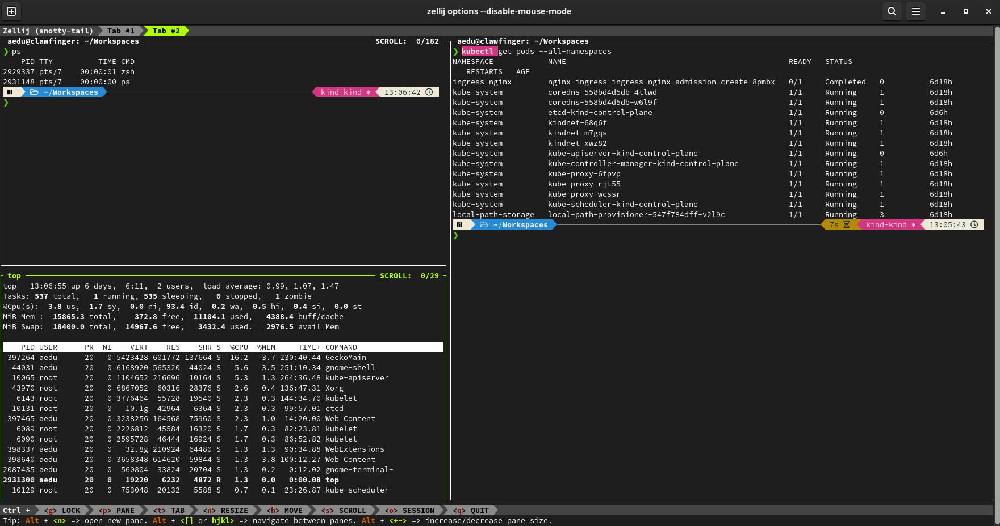

# Terminal Window Manager

### Quick links
* [Overview](#overview)

## Overview
Terminal window managers provide features such as:
* ***Persistency***: When a network connection is dropped or the terminal window is closed this will 
  typically terminate all child process of the session. With a terminal manager this does not happen. 
  Instead the session is just detached and can be reattached to later.
* ***Multiple Windows***: A single terminal window can be split into multiple areas each running a 
  different application.
* ***Session Sharing***: Multiple computers can connect to the same session allowing for 
  collaboration for multiple users.

## Zellij
Build in Rust and uses WASM for plugins

**Features**
* Zellij has a built-in discoverable UI - you don't need to look up cheat-sheets to find commands
* Zellij has Sixel graphics support
* Zellij has built-in native floating terminal windows - you can open multiple floating terminals, toggle their visibility, embed/float them, and still see activity happening in the panes below them
* Zellij has a built-in layout system
* Zellij has a built-in plugin system
* In Zellij, you can use your default editor (eg. vim) to search through, edit and save a pane's scrollback
* Zellij has true multiplayer sessions - meaning that even in the same tab, each user gets their own cursor (similar to Google docs)
* Zellij has sane defaults and a nice UI out of the box

