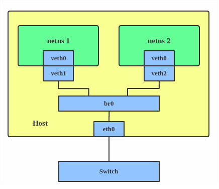

# macvlan 

Use macvlan if you want a MAC address and presence on the phyical lan. This is a great fit for an 
application that you want to interact with the other networked devices in a way that simulates a full 
physical device e.g. unique MAC and address.

### Quick links
* [.. up dir](../README.md)
* [Overview](#overview)
  * [Create via Nix](#create-via-nix)
  * [Create via iproute2](#create-via-iproute2)
  * [Create via docker](#create-via-docker)

## Overview

**References**
* [Docker macvlan tutorial](https://docs.docker.com/engine/network/tutorials/macvlan/)
* [Red Hat virtual interfaces](https://developers.redhat.com/blog/2018/10/22/introduction-to-linux-interfaces-for-virtual-networking)
* [Sirchia nixos-config](https://github.com/sirchia/NixOS/blob/main/etc/nixos/container-services/traefik.nix)

Before macvlans you could accomplish the same thing by creating VETH devices attached to a 
network bridge on the host.



Now with MACVALAN you can bind a physical interface that is associated with a MACVLAN directly to 
namespaces without the need for a bridge when using the macvlan `bridge` mode.


**macvlan modes**
* In `private` mode it is not possible for the macvlan to communicate with the parent interface.
* In `vepa` mode with a smart switch it is possible to communicate with the parent interface.
* In `bridge` mode it can fully communicate with the parent interface. Usually what you want

**Prerequisites**
* Most cloud providers block `macvlan` networking, making this only useful on homelabs
* Only works on Linux and requires a kernel of 4.0 or newer
* Not supported in rootless docker mode

### Create via Nix
Create host macvlan with a dedicated static IP on the host that we can then use Docker to port 
forward to will create maximum isolation while still allowing for a dedicated IP address on the LAN.

```nix
networking = {
  macvlans.${app.name} = {
    interface = "${app.nic.name}";
    mode = "bridge";
  };
  interfaces.${app.name}.ipv4.addresses = [
    { address = "${app.nic.ip}"; prefixLength = 32; }
  ];
};
```

Note if attaching your Docker container to the network directly with a Docker MacVLAN then you need 
to setup an additional MacVLAN on the host and setup a route in order to see the docker container 
from the host. This isn't necessary for other devices on the network to see it only the host to see 
it.
```nix
systemd.services."podman-network-${app.name}" = {
  path = [ pkgs.podman pkgs.iproute2 ];
  serviceConfig = {
    Type = "oneshot";
    RemainAfterExit = true;
    ExecStop = [
      "podman network rm -f ${app.name}"
      "ip route del ${app.nic.ip2} dev ${app.name} &>/dev/null || true"
    ];
  };
  script = ''
    if ! podman network exists ${app.name}; then
      podman network create -d macvlan --subnet=${app.nic.subnet} --gateway=${app.nic.gateway} -o parent=${app.nic.name} ${app.name}
    fi

    # Setup host to container access by adding an explicit route
    ip route add ${app.nic.ip2} dev ${app.name} &>/dev/null || true
  '';
};
```

### Create via iproute2


1. Create the macvlan and add manual routes
   ```bash
   sudo ip link add macvlan0 link ens18 type macvlan mode bridge
   sudo ip addr add 192.168.1.60/32 dev macvlan0
   sudo ip link set macvlan0 up
   sudo ip route add 192.168.1.61/32 dev macvlan0
   sudo ip route add 192.168.1.62/32 dev macvlan0
   ```
2. Remove when done 
   ```bash
   $ ip route del 192.168.1.60
   $ ip route del 192.168.1.61
   $ ip link set macvlan0 down
   $ ip link delete macvlan0
   ```

### Create via docker
* `subnet` should be your network subnet
* `gateway` should be your network gateway
* `-o parent=ens18` should be your device's NIC found with `ip a`
* `my-macvlan` is the name of your new macvlan network

1. Create macvlan
   ```bash
   docker network create -d macvlan \
     --subnet=192.168.1.0/24 \
     --gateway=192.168.1.1 \
     -o parent=ens18 \
     my-macvlan
   ```

2. Inspect docker network
   ```bash
   docker network inspect my-macvlan
   ```

3. Attach a container to the macvlan network
   1. Deploy a test container, needs priviledged for ping
      ```bash
      docker run --privileged --rm -dit \
        --name alpine0
        --network my-macvlan \
        --ip=192.168.1.60 \
        alpine:latest \
        /bin/sh
      ```
   2. View how the container sees its networking
      ```bash
      docker exec -it alpine0 ip a
      docker exec -it alpine0 ip route
      ```
4. Create a local macvlan for the host to see the containers
   ```bash
   sudo ip link add macvlan0 link ens18 type macvlan mode bridge
   sudo ip addr add 192.168.1.60/32 dev macvlan0
   sudo ip link set macvlan0 up
   sudo ip route add 192.168.1.61/32 dev macvlan0
   sudo ip route add 192.168.1.62/32 dev macvlan0
   ```

<!-- 
vim: ts=2:sw=2:sts=2
-->
